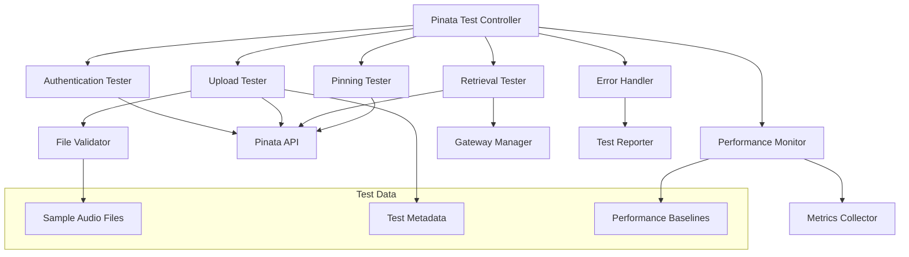

# Design Document

## Overview

This design outlines a comprehensive testing framework for the Pinata API integration in our music platform. The system will provide automated testing capabilities to validate Pinata's IPFS functionality, including file uploads, retrieval, pinning operations, and error handling. The testing framework will be designed as both a development tool and a monitoring system for production health checks.

## Architecture

### Core Components



### System Flow

1. **Test Initialization**: Load configuration, validate credentials, prepare test data
2. **Authentication Testing**: Verify API key validity and service connectivity
3. **Upload Testing**: Test various audio file formats and sizes
4. **Retrieval Testing**: Validate file accessibility through different gateways
5. **Pinning Operations**: Test pin/unpin functionality and status checking
6. **Performance Monitoring**: Measure and report performance metrics
7. **Error Simulation**: Test edge cases and failure scenarios
8. **Report Generation**: Compile comprehensive test results

## Components and Interfaces

### 1. Pinata Test Controller

**Purpose**: Central orchestrator for all Pinata API tests

**Interface**:
```typescript
interface PinataTestController {
  runFullTestSuite(): Promise<TestSuiteResult>;
  runSpecificTest(testType: TestType): Promise<TestResult>;
  schedulePeriodicTests(interval: number): void;
  getTestHistory(): TestResult[];
}

interface TestSuiteResult {
  overall: 'pass' | 'fail' | 'warning';
  timestamp: string;
  duration: number;
  tests: TestResult[];
  summary: TestSummary;
}

interface TestResult {
  testName: string;
  status: 'pass' | 'fail' | 'skip';
  duration: number;
  details: any;
  error?: string;
  metrics?: PerformanceMetrics;
}
```

### 2. Authentication Tester

**Purpose**: Validate Pinata API credentials and connectivity

**Interface**:
```typescript
interface AuthenticationTester {
  testCredentials(): Promise<AuthTestResult>;
  testConnectivity(): Promise<ConnectivityResult>;
  validateApiLimits(): Promise<ApiLimitsResult>;
}

interface AuthTestResult {
  valid: boolean;
  keyType: 'admin' | 'pinning' | 'gateway';
  permissions: string[];
  expirationDate?: string;
}
```

### 3. Upload Tester

**Purpose**: Test file upload functionality with various audio formats

**Interface**:
```typescript
interface UploadTester {
  testAudioUpload(file: File, options?: UploadOptions): Promise<UploadTestResult>;
  testBatchUpload(files: File[]): Promise<BatchUploadResult>;
  testLargeFileUpload(file: File): Promise<LargeFileResult>;
  testMetadataUpload(metadata: any): Promise<MetadataUploadResult>;
}

interface UploadTestResult {
  success: boolean;
  ipfsHash?: string;
  uploadTime: number;
  fileSize: number;
  metadata?: PinataMetadata;
  error?: string;
}

interface UploadOptions {
  customMetadata?: Record<string, any>;
  pinataOptions?: PinataOptions;
  progressCallback?: (progress: number) => void;
}
```

### 4. Retrieval Tester

**Purpose**: Test file retrieval and gateway performance

**Interface**:
```typescript
interface RetrievalTester {
  testFileRetrieval(ipfsHash: string): Promise<RetrievalResult>;
  testGatewayPerformance(ipfsHash: string): Promise<GatewayPerformanceResult>;
  testStreamingCapability(ipfsHash: string): Promise<StreamingResult>;
  testCacheEfficiency(): Promise<CacheResult>;
}

interface RetrievalResult {
  accessible: boolean;
  responseTime: number;
  fileSize: number;
  contentType: string;
  gateway: string;
  error?: string;
}

interface GatewayPerformanceResult {
  gatewayResults: Array<{
    gateway: string;
    responseTime: number;
    success: boolean;
    error?: string;
  }>;
  fastestGateway: string;
  averageResponseTime: number;
}
```

### 5. Pinning Tester

**Purpose**: Test pinning operations and management

**Interface**:
```typescript
interface PinningTester {
  testPinFile(ipfsHash: string): Promise<PinResult>;
  testUnpinFile(ipfsHash: string): Promise<UnpinResult>;
  testPinStatus(ipfsHash: string): Promise<PinStatusResult>;
  testPinList(): Promise<PinListResult>;
}

interface PinResult {
  success: boolean;
  pinDate?: string;
  pinSize?: number;
  error?: string;
}

interface PinListResult {
  totalPins: number;
  pins: Array<{
    ipfsHash: string;
    pinDate: string;
    size: number;
    metadata?: any;
  }>;
  totalSize: number;
}
```

### 6. Performance Monitor

**Purpose**: Monitor and analyze performance metrics

**Interface**:
```typescript
interface PerformanceMonitor {
  measureUploadSpeed(fileSize: number, duration: number): UploadSpeed;
  measureGatewayLatency(gateway: string): Promise<LatencyResult>;
  trackApiResponseTimes(): Promise<ApiPerformanceResult>;
  generatePerformanceReport(): PerformanceReport;
}

interface PerformanceMetrics {
  uploadSpeed: number; // MB/s
  downloadSpeed: number; // MB/s
  gatewayLatency: number; // ms
  apiResponseTime: number; // ms
  successRate: number; // percentage
}

interface PerformanceReport {
  timestamp: string;
  metrics: PerformanceMetrics;
  trends: PerformanceTrends;
  recommendations: string[];
}
```

## Data Models

### Test Configuration

```typescript
interface TestConfiguration {
  pinataCredentials: {
    apiKey: string;
    secretKey: string;
  };
  testFiles: {
    small: File; // < 1MB
    medium: File; // 1-10MB
    large: File; // > 10MB
    formats: File[]; // Various audio formats
  };
  gateways: string[];
  performanceBaselines: {
    maxUploadTime: number;
    maxRetrievalTime: number;
    minSuccessRate: number;
  };
  testOptions: {
    retryAttempts: number;
    timeoutDuration: number;
    concurrentUploads: number;
  };
}
```

### Test Data Management

```typescript
interface TestDataManager {
  generateTestAudioFiles(): Promise<File[]>;
  createTestMetadata(file: File): TestMetadata;
  cleanupTestFiles(ipfsHashes: string[]): Promise<void>;
  validateTestFile(file: File): ValidationResult;
}

interface TestMetadata {
  testId: string;
  fileName: string;
  fileType: string;
  fileSize: number;
  uploadTimestamp: string;
  testPurpose: string;
  expectedDuration?: number;
}
```

## Error Handling

### Error Categories

1. **Authentication Errors**
   - Invalid API credentials
   - Expired keys
   - Insufficient permissions

2. **Upload Errors**
   - File size limits exceeded
   - Unsupported file formats
   - Network timeouts
   - Rate limiting

3. **Retrieval Errors**
   - File not found
   - Gateway unavailable
   - Corrupted data

4. **Pinning Errors**
   - Pin quota exceeded
   - Already pinned
   - Insufficient balance

### Error Handling Strategy

```typescript
interface ErrorHandler {
  handleAuthError(error: AuthError): TestResult;
  handleUploadError(error: UploadError): TestResult;
  handleRetrievalError(error: RetrievalError): TestResult;
  handlePinningError(error: PinningError): TestResult;
  categorizeError(error: Error): ErrorCategory;
  suggestResolution(error: Error): string[];
}

interface ErrorRecovery {
  retryWithBackoff(operation: () => Promise<any>, maxRetries: number): Promise<any>;
  fallbackToAlternativeGateway(ipfsHash: string): Promise<string>;
  queueForLaterRetry(operation: FailedOperation): void;
}
```

## Testing Strategy

### Test Types

1. **Unit Tests**: Individual component functionality
2. **Integration Tests**: End-to-end workflows
3. **Performance Tests**: Speed and efficiency metrics
4. **Load Tests**: Concurrent operation handling
5. **Stress Tests**: System limits and failure points
6. **Regression Tests**: Ensure existing functionality remains intact

### Test Data Strategy

- **Synthetic Audio Files**: Generated test files of various sizes and formats
- **Real Audio Samples**: Actual music files for realistic testing
- **Edge Case Files**: Corrupted, empty, or malformed files
- **Metadata Variations**: Different metadata structures and sizes

### Automated Testing Pipeline


### Test Scheduling

- **Continuous**: Real-time monitoring during development
- **Daily**: Comprehensive test suite execution
- **Weekly**: Full performance analysis and reporting
- **On-Demand**: Manual test execution for specific scenarios

## Implementation Considerations

### Security

- Secure credential management
- Test data isolation
- Cleanup of sensitive test files
- Rate limiting compliance

### Performance

- Parallel test execution where possible
- Efficient test data generation
- Minimal impact on production systems
- Optimized cleanup procedures

### Monitoring

- Real-time test result dashboards
- Alert system for test failures
- Historical trend analysis
- Performance regression detection

### Scalability

- Configurable test parameters
- Extensible test framework
- Support for multiple environments
- Batch processing capabilities

## Success Metrics

### Key Performance Indicators

1. **Reliability**: 99%+ test success rate
2. **Performance**: Upload speeds > 1MB/s
3. **Availability**: Gateway response time < 2s
4. **Coverage**: All audio formats supported
5. **Efficiency**: Test suite completion < 10 minutes

### Monitoring Dashboards

- Real-time test status
- Performance trend graphs
- Error rate tracking
- Gateway performance comparison
- API usage statistics

This testing framework will provide comprehensive validation of our Pinata integration, ensuring reliable audio storage and retrieval for our music platform while maintaining high performance standards.