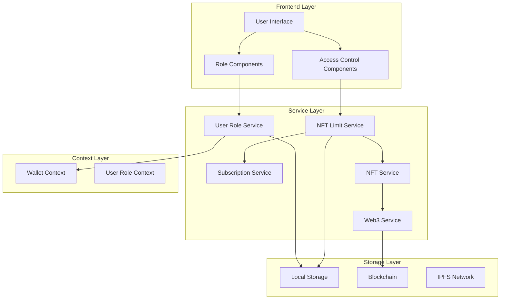

# Design Document

## Overview

The User Role Management system implements a comprehensive role-based access control (RBAC) framework that differentiates between artist and normal user accounts. The system integrates with the existing wallet infrastructure, NFT services, and subscription management to provide seamless role-based functionality. Artists gain access to music uploading capabilities while normal users receive NFT rewards with usage limits that can be extended through subscription plans.

## Architecture

### High-Level Architecture



### Component Integration

The system integrates with existing components:
- **WalletContext**: Extended to include user role information
- **NFTService**: Enhanced with minting limits and tracking
- **SubscriptionService**: Connected to NFT limit management
- **Web3Service**: Used for role determination and NFT operations

## Components and Interfaces

### 1. User Role Service

**Purpose**: Manages user role determination, storage, and validation.

**Key Methods**:
```typescript
interface UserRoleService {
  determineUserRole(walletAddress: string): Promise<UserRole>
  getUserRole(walletAddress: string): UserRole | null
  setUserRole(walletAddress: string, role: UserRole): void
  isArtist(walletAddress: string): boolean
  canUploadMusic(walletAddress: string): boolean
}
```

**Role Determination Logic**:
1. Check local storage for cached role
2. Query blockchain for artist NFT ownership
3. Check whitelist of known artist addresses
4. Default to 'normal' user if no artist indicators found

### 2. NFT Limit Service

**Purpose**: Tracks and enforces NFT minting limits for normal users.

**Key Methods**:
```typescript
interface NFTLimitService {
  checkMintingEligibility(walletAddress: string): Promise<MintingEligibility>
  recordNFTMint(walletAddress: string): Promise<void>
  getRemainingMints(walletAddress: string): number
  resetWeeklyLimits(): void
  upgradeUserLimits(walletAddress: string, subscriptionTier: string): void
}
```

**Limit Management**:
- Default weekly limit: 10 NFTs for normal users
- Premium subscription: 50 NFTs per week
- VIP subscription: Unlimited NFTs
- Artists: Unlimited NFTs (no limits)

### 3. Enhanced Wallet Context

**Extended State**:
```typescript
interface ExtendedWalletState extends WalletState {
  userRole: UserRole | null
  nftMintingStatus: {
    remainingMints: number
    weeklyLimit: number
    resetDate: Date
    isLimited: boolean
  }
  subscriptionStatus: SubscriptionStatus | null
}
```

### 4. Role-Based UI Components

**ArtistUploadInterface**: Music upload functionality (artists only)
**NFTMintingDisplay**: Shows minting status and limits (normal users)
**SubscriptionPrompt**: Upgrade prompts when limits reached
**RoleIndicator**: Visual indicator of user role and status

## Data Models

### User Role Types

```typescript
type UserRole = 'artist' | 'normal'

interface UserRoleData {
  walletAddress: string
  role: UserRole
  verificationMethod: 'nft_ownership' | 'whitelist' | 'manual' | 'default'
  verifiedAt: Date
  lastUpdated: Date
  metadata?: {
    artistName?: string
    verificationNFT?: {
      contractAddress: string
      tokenId: string
    }
  }
}
```

### NFT Minting Limits

```typescript
interface NFTMintingLimits {
  walletAddress: string
  weeklyLimit: number
  currentWeekMints: number
  weekStartDate: Date
  subscriptionTier: string | null
  lastMintDate: Date | null
  totalMints: number
}

interface MintingEligibility {
  canMint: boolean
  remainingMints: number
  reason?: string
  upgradeOptions?: SubscriptionTier[]
}
```

### Subscription Integration

```typescript
interface SubscriptionBenefits {
  unlimitedNFTs?: boolean
  weeklyNFTLimit?: number
  priorityMinting?: boolean
  exclusiveContent?: boolean
}
```

## Error Handling

### Role Determination Errors
- **Network Failure**: Fallback to cached role or default to 'normal'
- **Invalid Wallet**: Clear role data and require reconnection
- **Verification Failure**: Log error and use default role

### NFT Minting Errors
- **Limit Exceeded**: Show subscription upgrade options
- **Network Issues**: Queue mint for retry
- **Insufficient Gas**: Provide gas estimation and retry options
- **Contract Errors**: Log detailed error and show user-friendly message

### Subscription Errors
- **Payment Failure**: Maintain current limits until retry
- **Expired Subscription**: Gracefully downgrade to default limits
- **Invalid Tier**: Reset to basic tier and notify user

## Testing Strategy

### Unit Tests
- **UserRoleService**: Role determination logic, caching, validation
- **NFTLimitService**: Limit calculations, reset logic, subscription upgrades
- **Enhanced WalletContext**: State management, role integration
- **UI Components**: Role-based rendering, access control

### Integration Tests
- **Wallet Connection Flow**: Role determination after connection
- **NFT Minting Flow**: Limit enforcement and tracking
- **Subscription Upgrade Flow**: Limit updates and benefit activation
- **Cross-Service Communication**: Service interaction and data consistency

### End-to-End Tests
- **Artist Workflow**: Connect wallet → Upload music → Verify access
- **Normal User Workflow**: Connect wallet → Listen to music → Receive NFTs → Hit limits → Upgrade subscription
- **Role Switching**: Artist account behavior vs normal account behavior

## Security Considerations

### Role Verification Security
- **Blockchain Verification**: Use on-chain data for role determination when possible
- **Whitelist Management**: Secure artist whitelist with admin controls
- **Cache Validation**: Periodically re-verify cached roles against blockchain

### Access Control Security
- **Frontend Enforcement**: Hide UI elements based on role
- **Backend Validation**: Verify permissions on all API calls
- **Smart Contract Integration**: Use contract-level access controls where applicable

### Data Protection
- **Local Storage Encryption**: Encrypt sensitive role data in local storage
- **Wallet Address Validation**: Validate wallet addresses before role assignment
- **Audit Logging**: Log all role changes and access attempts

## Performance Optimizations

### Caching Strategy
- **Role Caching**: Cache user roles locally with TTL
- **Limit Caching**: Cache NFT limits with real-time updates
- **Subscription Caching**: Cache subscription status with periodic refresh

### Lazy Loading
- **Role Determination**: Only determine role when needed
- **Limit Checking**: Check limits only before minting attempts
- **UI Components**: Load role-specific components on demand

### Batch Operations
- **Limit Updates**: Batch multiple limit updates
- **Role Verification**: Batch verify multiple users when possible
- **Subscription Checks**: Batch subscription status checks

## Migration Strategy

### Phase 1: Core Infrastructure
- Implement UserRoleService and NFTLimitService
- Extend WalletContext with role management
- Add basic role determination logic

### Phase 2: UI Integration
- Implement role-based UI components
- Add access control to existing components
- Integrate with music upload functionality

### Phase 3: Subscription Integration
- Connect NFT limits to subscription service
- Implement upgrade flows and limit management
- Add subscription-based benefit system

### Phase 4: Advanced Features
- Add artist verification system
- Implement advanced analytics and tracking
- Optimize performance and add monitoring