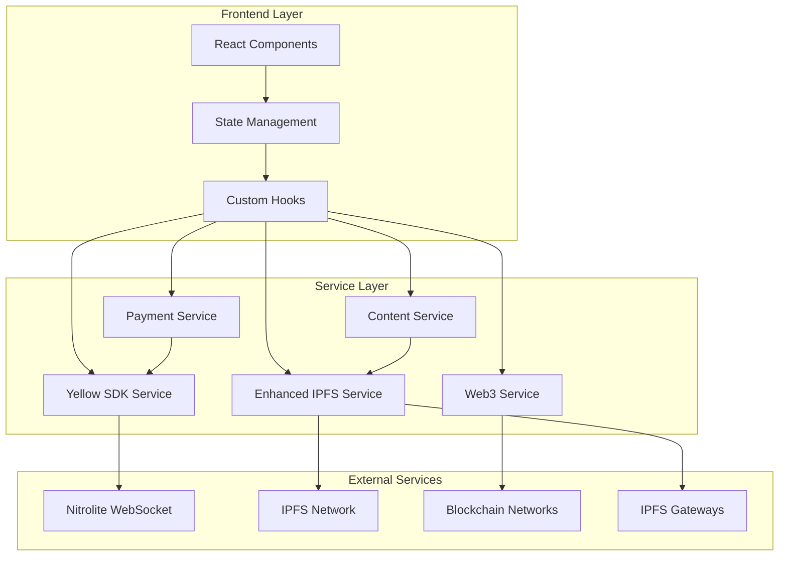
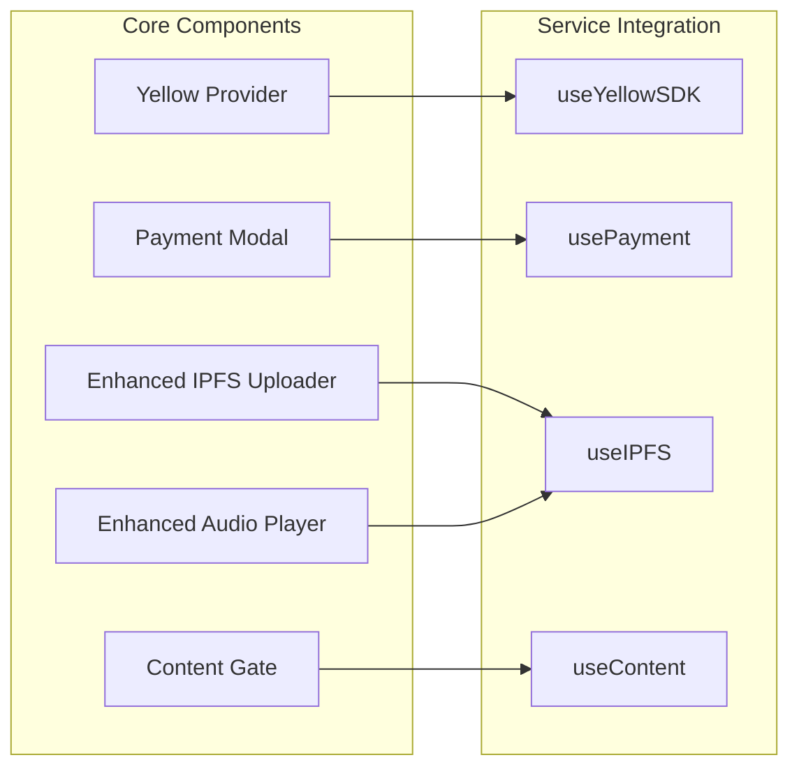

# Yellow SDK Integration Design Document

## Overview

This design document outlines the architecture for integrating the Yellow SDK (Nitrolite) into Sonic Wave to enable a hybrid NFT + subscription model with off-chain microtransactions, while fixing existing IPFS upload and playback issues. The solution maintains the core NFT functionality while adding instant, low-latency payment options.

## Architecture

### High-Level Architecture



### Component Architecture



## Components and Interfaces

### 1. Yellow SDK Service

**Purpose:** Manages Nitrolite WebSocket connections and off-chain state channels.

**Key Methods:**
- `initializeConnection()`: Establish WebSocket connection
- `authenticateUser(walletAddress)`: Authenticate user session
- `createPaymentChannel()`: Create off-chain payment channel
- `processTransaction(amount, contentId)`: Process microtransaction
- `settleChannel()`: Settle off-chain transactions on-chain

**Interfaces:**
```typescript
interface YellowSDKConfig {
  websocketUrl: string;
  apiKey: string;
  network: 'mainnet' | 'testnet';
}

interface PaymentChannel {
  channelId: string;
  userAddress: string;
  balance: number;
  transactions: Transaction[];
}

interface Transaction {
  id: string;
  amount: number;
  contentId: string;
  timestamp: number;
  type: 'payment' | 'subscription' | 'nft_access';
}
```

### 2. Enhanced IPFS Service

**Purpose:** Provides reliable IPFS upload and retrieval with proper error handling and gateway optimization.

**Key Improvements:**
- Real IPFS upload implementation using Pinata/Web3.Storage
- Proper file validation and processing
- Gateway failover and optimization
- Audio metadata extraction
- Progress tracking and error recovery

**Interfaces:**
```typescript
interface IPFSUploadResult {
  hash: string;
  url: string;
  metadata: AudioMetadata;
  size: number;
}

interface IPFSGatewayStatus {
  url: string;
  latency: number;
  available: boolean;
  lastChecked: number;
}
```

### 3. Payment Service

**Purpose:** Orchestrates payment flows between subscriptions, microtransactions, and NFT access.

**Key Methods:**
- `checkAccess(contentId, userAddress)`: Determine access method
- `processPayment(amount, method)`: Handle payment processing
- `validateSubscription(userAddress)`: Check subscription status
- `grantNFTAccess(contractAddress, tokenId)`: Verify and grant NFT access

### 4. Content Access Control

**Purpose:** Manages content tiers and access permissions.

**Content Tiers:**
- **Free**: Open access content
- **Pay-per-use**: Microtransaction required
- **NFT-gated**: Requires specific NFT ownership
- **Subscription**: Requires active subscription
- **Premium**: Combination of subscription + NFT benefits

## Data Models

### User Session Model
```typescript
interface UserSession {
  walletAddress: string;
  chainId: number;
  subscriptionStatus: SubscriptionStatus;
  paymentChannel: PaymentChannel;
  nftHoldings: NFTHolding[];
  balance: number;
  accessRights: AccessRight[];
}

interface SubscriptionStatus {
  isActive: boolean;
  tier: 'basic' | 'premium' | 'vip';
  expiresAt: Date;
  autoRenew: boolean;
}

interface NFTHolding {
  contractAddress: string;
  tokenId: string;
  metadata: NFTMetadata;
  benefits: NFTBenefit[];
}
```

### Content Model
```typescript
interface ContentItem {
  id: string;
  title: string;
  artist: string;
  accessTier: AccessTier;
  ipfsHash: string;
  metadata: AudioMetadata;
  pricing: ContentPricing;
  nftRequirements?: NFTRequirement[];
}

interface ContentPricing {
  payPerUse?: number;
  subscriptionTiers: string[];
  nftDiscount?: number;
}
```

## Error Handling

### IPFS Upload Error Recovery
1. **File Validation Errors**: Clear user feedback with specific requirements
2. **Upload Failures**: Automatic retry with exponential backoff
3. **Gateway Failures**: Automatic failover to alternative gateways
4. **Network Issues**: Offline queue with sync when connection resumes

### Yellow SDK Error Handling
1. **WebSocket Disconnection**: Automatic reconnection with state preservation
2. **Transaction Failures**: Rollback mechanisms and user notification
3. **Authentication Issues**: Re-authentication flow with session recovery
4. **Channel Settlement Errors**: Retry logic with manual settlement option

### Payment Flow Error Handling
1. **Insufficient Balance**: Clear upgrade paths and payment options
2. **Subscription Expiry**: Grace period with renewal prompts
3. **NFT Verification Failures**: Fallback to alternative access methods
4. **Network Congestion**: Off-chain processing with delayed settlement

## Testing Strategy

### Unit Testing
- **Service Layer**: Mock external dependencies, test core logic
- **Component Layer**: Test user interactions and state management
- **Hook Layer**: Test custom hooks with various scenarios
- **Error Scenarios**: Test all error conditions and recovery paths

### Integration Testing
- **IPFS Integration**: Test actual file uploads and retrievals
- **Yellow SDK Integration**: Test WebSocket connections and transactions
- **Payment Flows**: Test end-to-end payment scenarios
- **Content Access**: Test all access tier combinations

### Performance Testing
- **IPFS Gateway Performance**: Test latency and failover
- **WebSocket Performance**: Test high-frequency transactions
- **Audio Streaming**: Test playback quality and buffering
- **State Management**: Test large datasets and concurrent users

### User Experience Testing
- **Upload Flow**: Test drag-and-drop, progress indicators, error states
- **Payment Flow**: Test subscription vs pay-per-use decisions
- **Content Access**: Test seamless access across different tiers
- **Mobile Experience**: Test responsive design and touch interactions

## Security Considerations

### Authentication & Authorization
- Wallet signature verification for session authentication
- Time-limited session tokens with automatic refresh
- Role-based access control for different content tiers
- Secure WebSocket connections with proper encryption

### Payment Security
- Off-chain transaction validation and fraud detection
- Secure channel settlement with multi-signature requirements
- Balance verification and double-spend prevention
- Audit trails for all financial transactions

### Content Protection
- IPFS content encryption for premium tiers
- Access token validation for streaming
- Rate limiting to prevent abuse
- Watermarking for NFT-exclusive content

## Implementation Phases

### Phase 1: Foundation (Week 1)
- Set up Yellow SDK service structure
- Fix IPFS service implementation
- Create enhanced upload component
- Implement basic error handling

### Phase 2: Payment Integration (Week 2)
- Implement Nitrolite WebSocket connection
- Create payment channel management
- Build subscription system
- Add microtransaction processing

### Phase 3: Content Access Control (Week 3)
- Implement content tier system
- Add NFT verification and benefits
- Create access control middleware
- Build content gating components

### Phase 4: Enhanced UX (Week 4)
- Add real-time state updates
- Implement progress indicators
- Create payment flow modals
- Add comprehensive error states

### Phase 5: Testing & Optimization (Week 5)
- Comprehensive testing suite
- Performance optimization
- Security audit
- User experience refinement